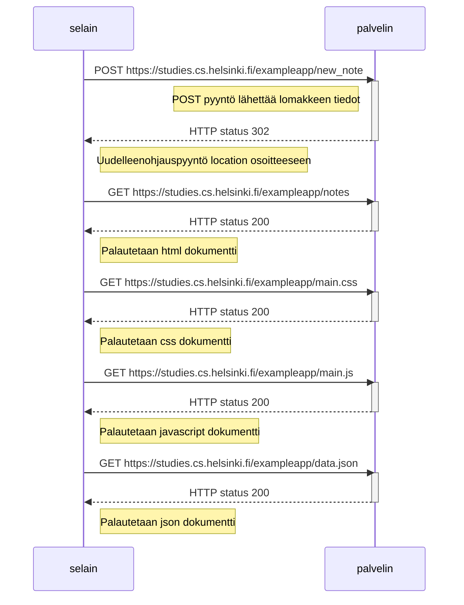

```mermaid
sequenceDiagram
    participant selain
    participant palvelin

    selain->>palvelin: POST https://studies.cs.helsinki.fi/exampleapp/new_note
    activate palvelin

    Note left of palvelin: POST pyyntö lähettää lomakkeen tiedot 

    palvelin-->>selain: HTTP status 302
    deactivate palvelin

    Note right of selain: Uudelleenohjauspyyntö location osoitteeseen

    selain->>palvelin: GET https://studies.cs.helsinki.fi/exampleapp/notes
    activate palvelin
    palvelin-->>selain: HTTP status 200
    deactivate palvelin

    Note right of selain: Palautetaan html dokumentti

    selain->>palvelin: GET https://studies.cs.helsinki.fi/exampleapp/main.css
    activate palvelin
    palvelin-->>selain: HTTP status 200
    deactivate palvelin 

    Note right of selain: Palautetaan css dokumentti

    selain->>palvelin: GET https://studies.cs.helsinki.fi/exampleapp/main.js
    activate palvelin
    palvelin-->>selain: HTTP status 200
    deactivate palvelin 

    Note right of selain: Palautetaan javascript dokumentti

    selain->>palvelin: GET https://studies.cs.helsinki.fi/exampleapp/data.json
    activate palvelin
    palvelin-->>selain: HTTP status 200
    deactivate palvelin

    Note right of selain: Palautetaan json dokumentti

```
