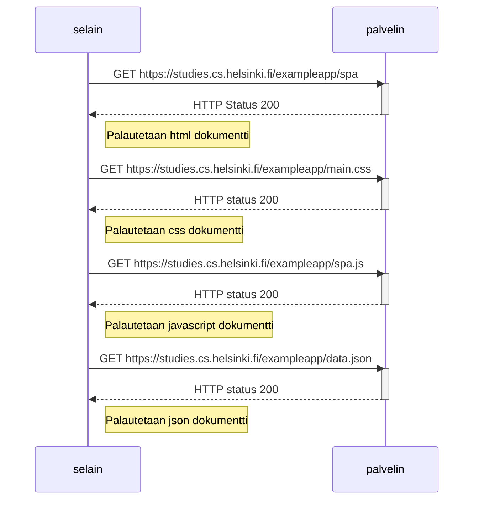

```mermaid
sequenceDiagram
    participant selain
    participant palvelin

    selain->>palvelin: GET https://studies.cs.helsinki.fi/exampleapp/spa
    activate palvelin

    palvelin-->>selain: HTTP Status 200
    deactivate palvelin

    Note right of selain: Palautetaan html dokumentti

    selain->>palvelin: GET https://studies.cs.helsinki.fi/exampleapp/main.css
    activate palvelin
    palvelin-->>selain: HTTP status 200
    deactivate palvelin

    Note right of selain: Palautetaan css dokumentti

    selain->>palvelin: GET https://studies.cs.helsinki.fi/exampleapp/spa.js
    activate palvelin
    palvelin-->>selain: HTTP status 200
    deactivate palvelin

    Note right of selain: Palautetaan javascript dokumentti

    selain->>palvelin: GET https://studies.cs.helsinki.fi/exampleapp/data.json
    activate palvelin
    palvelin-->>selain: HTTP status 200
    deactivate palvelin

    Note right of selain: Palautetaan json dokumentti
```