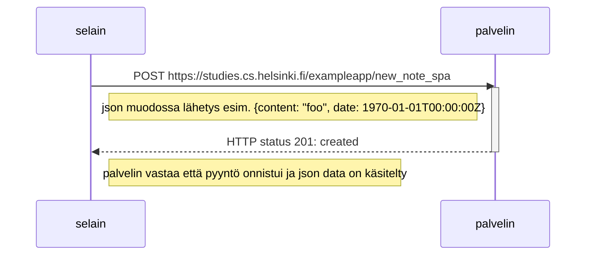

```mermaid
sequenceDiagram
    participant selain
    participant palvelin

    selain->>palvelin: POST https://studies.cs.helsinki.fi/exampleapp/new_note_spa
    activate palvelin

    Note left of palvelin: json muodossa lähetys esim. {content: "foo", date: 1970-01-01T00:00:00Z}

    palvelin-->>selain: HTTP status 201: created
    deactivate palvelin

    Note right of selain: palvelin vastaa että pyyntö onnistui ja json data on käsitelty
```